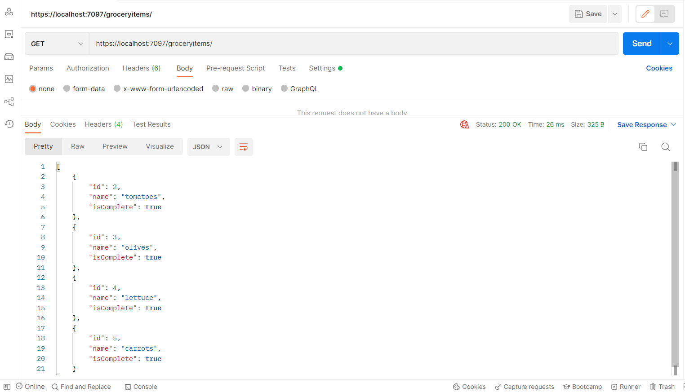

# Grocery API

This minimal API uses Entity Framework and SQL Server storage to allow anyone to GET, Post, Put, or Delete grocery list items. 

Routes Include:

 * Use **GET** to obtain all items: https://localhost:7097/groceryitems

 * Use **GET** and id to obtain all 1 item: https://localhost:7097/groceryitems/2

 * Use **GET** to obtain incomplete items: https://localhost:7097/groceryitems/incomplete

 * Use **GET** to obtain complete items: https://localhost:7097/groceryitems/complete

 * Use **POST** to post an item: https://localhost:7097/groceryitems/

    body:
     {
        "name": "lettuce",
        "isComplete": false
     }

 * Use **Put** to edit an item: https://localhost:7097/groceryitems/2

     body:
    {
        "id": 2,
        "name": "lettuce",
        "isComplete": true
    }

 * Use **DELETE** to delete an item: https://localhost:7097/groceryitems/2

 <!-- ![Postman image] -->

# Future directions:
[x] Use persistent storage (ex: MongoDB or SQL)

[ ] Unit tests

[ ] Implement authentication

https://docs.microsoft.com/en-us/aspnet/core/tutorials/min-web-api?view=aspnetcore-6.0&tabs=visual-studio

https://docs.microsoft.com/en-us/aspnet/core/fundamentals/minimal-apis?view=aspnetcore-6.0

https://docs.microsoft.com/en-us/aspnet/core/tutorials/razor-pages/sql?view=aspnetcore-6.0&tabs=visual-studio